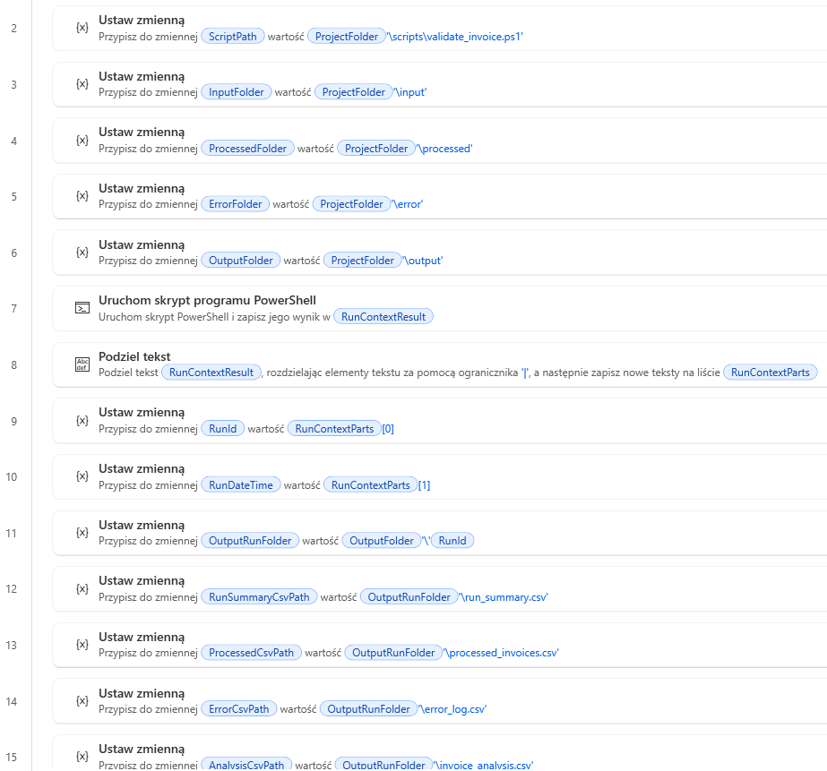
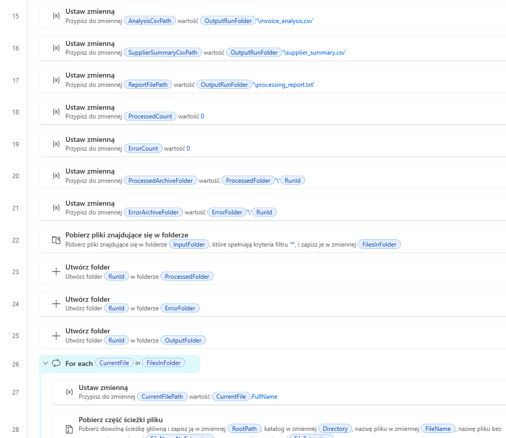
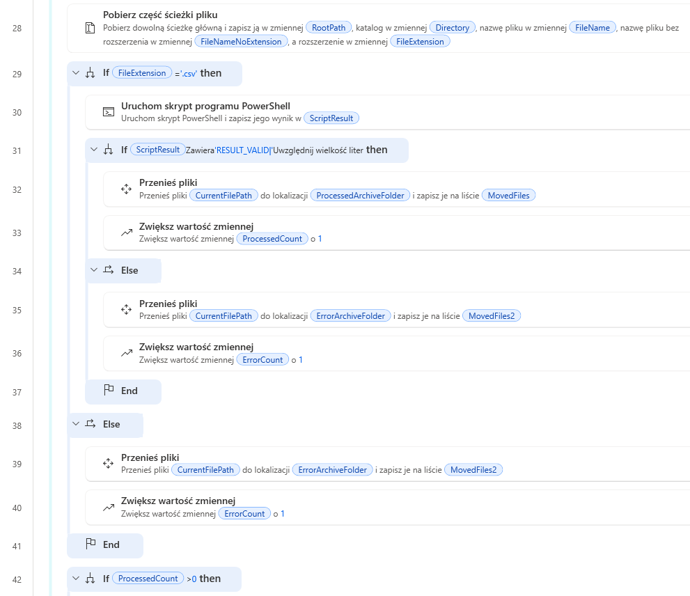
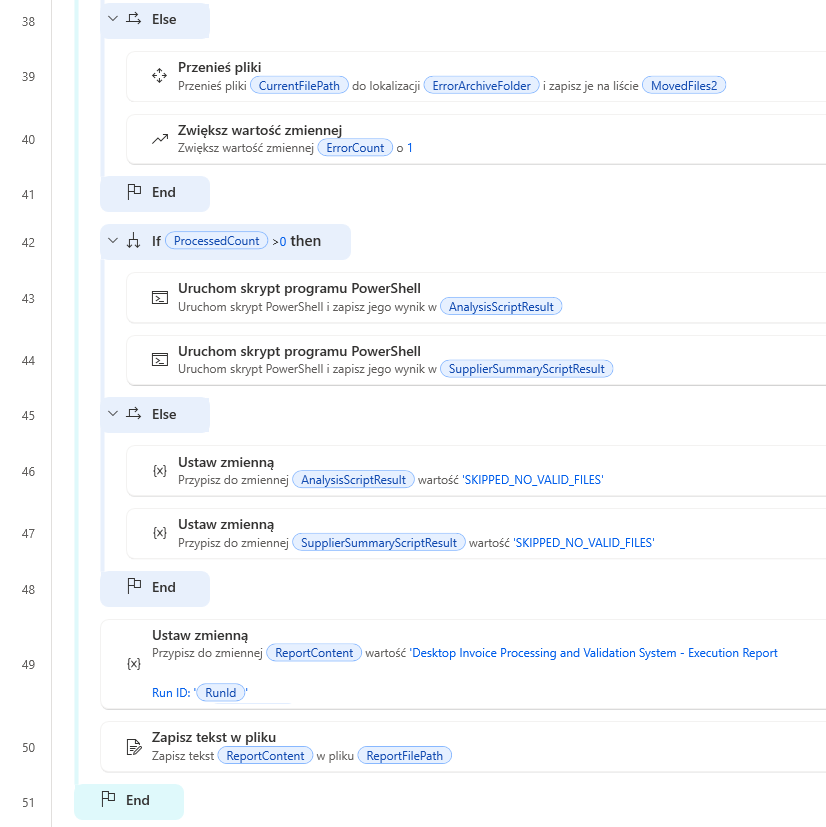

# Desktop Invoice Processing and Validation System

A project built with **Power Automate Desktop** and **PowerShell** for automated invoice file intake, validation, analysis, aggregation, and reporting.

## Overview

This project implements a desktop automation pipeline for processing invoice files placed in an input folder. The solution combines:

- **Power Automate Desktop** as the orchestration layer
- **PowerShell scripts** as processing and analytics modules
- **CSV-based output artifacts** for auditability and traceability

The system validates invoice data, separates valid and invalid records, analyzes processed invoices, generates supplier-level summaries, and stores all outputs in run-based archive folders.

## Project Goal

The purpose of this project is to demonstrate a realistic automation scenario.

The solution performs:

- file intake
- schema validation
- row-level business validation
- duplicate detection
- unsupported file-type logging
- invoice analysis
- supplier aggregation
- execution reporting
- run-based archiving

## Main Features

### 1. Input file processing

The system scans the `input` folder and processes incoming files one by one.

Supported input:

- `.csv` invoice batch files

Unsupported input:

- any non-CSV file, for example `.txt`

### 2. Run context generation

Each execution creates a unique **Run ID** and run timestamp.

Example:

- `20260423_175322`

This Run ID is used to create per-run archive folders for:

- processed files
- error files
- output reports

### 3. Invoice validation

The validation script checks each CSV file for:

- required columns
- empty file detection
- row-level data validation
- missing invoice number
- missing supplier
- non-numeric amount
- negative or zero amount
- missing date
- invalid date format
- duplicate invoice number within the same file

### 4. Unsupported file logging

If the input file is not a CSV file, the system:

- logs the file into `error_log.csv`
- marks it as invalid
- moves it into the run-specific error folder

### 5. Invoice analysis

After validation, the solution analyzes valid invoice rows and assigns:

- `AmountCategory`
  - `LOW`
  - `MEDIUM`
  - `HIGH`
- `RiskFlag`
  - `YES`
  - `NO`
- `AnalysisNote`

### 6. Supplier summary generation

The solution groups valid invoice records by supplier and calculates:

- invoice count
- total amount
- average amount
- maximum amount
- high-risk invoice count

### 7. Execution reporting

At the end of the run, the system generates an execution report containing:

- Run ID
- run date
- processed file count
- error file count
- generated output files
- analysis script status
- supplier summary script status

## Folder Structure

```text
Power Automate Project/
├── input/
├── processed/
├── error/
├── output/
├── scripts/
├── screenshots/
└── README.md
```

## What Happens Inside the System

### Step 1 — Run initialization

Power Automate Desktop starts the process and calls a PowerShell script that generates:

- `RunId`
- `RunDateTime`

These values are used throughout the whole execution.

### Step 2 — Run-based folder creation

The flow creates run-specific folders such as:

- `processed/<RunId>`
- `error/<RunId>`
- `output/<RunId>`

This allows each run to be archived separately without overwriting previous results.

### Step 3 — Input scanning

The flow reads all files from the `input` folder and iterates through them one by one.

### Step 4 — File type check

For each file:

- if the extension is `.csv`, the validation pipeline starts
- otherwise, the file is logged as unsupported and moved to the error archive

### Step 5 — Validation module

The flow calls:

- `validate_invoice.ps1`

This script:

- validates CSV schema
- validates every row
- logs valid rows into `processed_invoices.csv`
- logs invalid rows into `error_log.csv`
- generates `run_summary.csv`

### Step 6 — File routing

After validation:

- files that return a valid result are moved to `processed/<RunId>`
- invalid files are moved to `error/<RunId>`

### Step 7 — Analysis module

If at least one valid file was processed, the flow runs:

- `analyze_invoice_data.ps1`

This script reads valid invoice rows and creates:

- `invoice_analysis.csv`

### Step 8 — Aggregation module

Then the flow runs:

- `generate_supplier_summary.ps1`

This script groups data by supplier and creates:

- `supplier_summary.csv`

### Step 9 — Final reporting

Finally, the flow creates:

- `processing_report.txt`

This report summarizes the execution and confirms whether the post-processing modules completed successfully.

## PowerShell Modules

### `build_run_context.ps1`

Generates:

- Run ID
- run date

### `validate_invoice.ps1`

Handles:

- schema validation
- row validation
- duplicate detection
- processed row export
- error log export
- run summary export

### `analyze_invoice_data.ps1`

Adds:

- amount category
- risk flag
- analysis note

### `generate_supplier_summary.ps1`

Builds supplier-level aggregated metrics.

## Output Files

Each run produces output inside:

```text
output/<RunId>/
```

Generated files:

- `processed_invoices.csv`
- `error_log.csv`
- `run_summary.csv`
- `invoice_analysis.csv`
- `supplier_summary.csv`
- `processing_report.txt`

## Example Test Scenarios

The project was tested with:

- valid invoice batch files
- invoice batches with missing supplier values
- invalid numeric values
- negative amounts
- duplicate invoice numbers
- missing required columns
- unsupported file types such as `.txt`

## Screenshots








